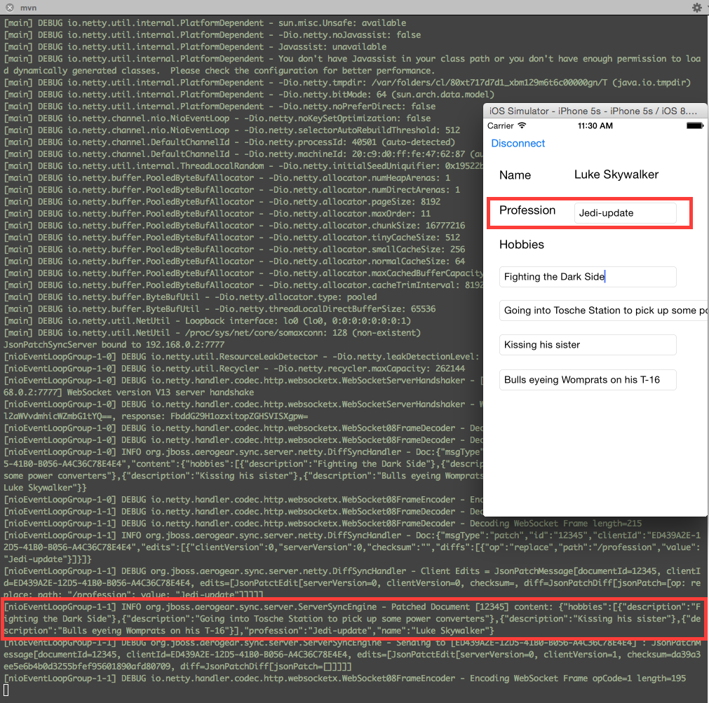

Jedi
====
Level: Beginner  
Technologies: Swift, iOS  
Summary: A basic example of [aerogear-ios-sync](https://github.com/aerogear/aerogear-ios-sync), [aerogear-ios-sync-client](https://github.com/aerogear/aerogear-ios-sync-client)  

What is it?
-----------
This project is a simple demo for the work around [AeroGear Differential Synchronization](https://github.com/aerogear/aerogear-sync-server).

System requirements
-------------------
- iOS8, iOS9, iOS10
- Xcode8

Configure
---------

This project requires that the [AeroGear Differential Synchronization Server](https://github.com/aerogear/aerogear-sync-server/tree/master/server/server-netty) be running. Please refer to that project for instructions for starting the server.

To run on actual device, select the version you want to use,  modify ```<Demo>/AeroGearSyncDemo/Info.plist``` and change the SyncServerHost to match your IP address and make sure it matches the one on [AeroGear Differential Synchronization Server](https://github.com/aerogear/aerogear-sync-server/tree/master/server/server-netty).

Build and Deploy Jedi
---------------------

### Run it in Xcode

The project uses [CocoaPods](http://cocoapods.org) for handling its dependencies. As a pre-requisite, install [CocoaPods](http://blog.cocoapods.org/) and then install the pod.

Choose the variant of the demo you want to use, enter the directory and run:

```bash
pod install
```

and then double click on the generated .xcworkspace to open in Xcode.


Application Flow
----------------

To test the application, you will need two Jedi demos running. For exemple:
- launch the application on your device
- launch the application on you simulator
- modify one field on simulator and see it instantly synchronized on device!



