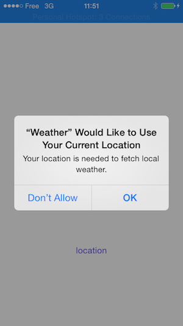
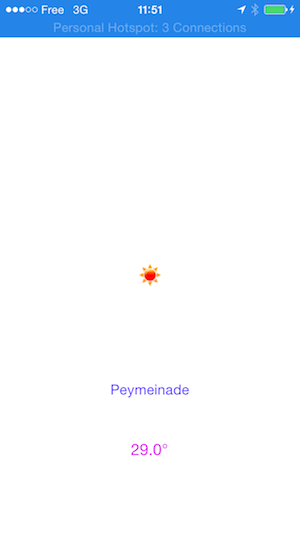

Weather
=======
Level: Beginner  
Technologies: Swift, iOS  
Summary: A basic example of aerogear-ios-http  

What is it?
-----------

This project is a very simple app, to show how to do a http call against a simple REST endpoint. The demo is implemented in [Swift](https://developer.apple.com/swift/) and uses the [aerogear-ios-http](https://github.com/aerogear/aerogear-ios-http) library. 

System requirements
-------------------
- iOS 8.X
- Xcode version 6 Beta 6

Configure
---------
Nothing to be done. 
The app fetches data from http://api.openweathermap.org/data/2.5/weather

Build and Deploy Buddies
------------------------

### Run it in Xcode

To run it, select a device and hit the run button on Xcode. We recommend to run Weather app on actual device rather than emulator.

The source code of [aerogear-ios-http](https://github.com/aerogear/aerogear-ios-http) library is contained in ../libs/AeroGearHttp shared folder.

> **NOTE:** Hopefully in the future and as the Swift language and tools around it mature, more straightforward distribution mechanisms will be employed using e.g [cocoapods](http://cocoapods.org) and framework builds. Currently neither cocoapods nor binary framework builds support Swift. For more information, consult this [mail thread](http://aerogear-dev.1069024.n5.nabble.com/aerogear-dev-Swift-Frameworks-Static-libs-and-Cocoapods-td8456.html) that describes the current situation.

Application Flow
----------------

When the application is launched for the first time, it will prompt you to accept to share your current location

Once you've accepted, it will display weather forecast in your area:

